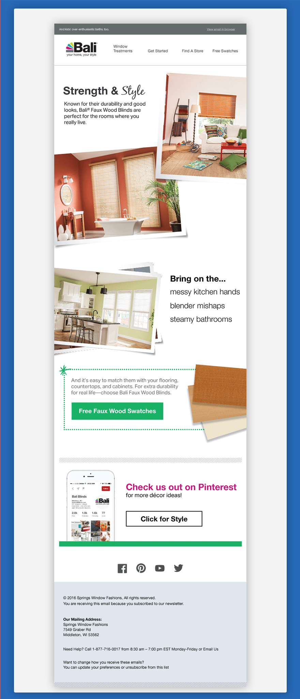

The past two years have seen major growth for digital initiatives at Springs. With this, I built a responsive email template for our Bali and Bali Lowe's email newsletters. Email is its own beast and figuring out how it all works was a major challenge for me, but in the end, I have a new respect for browser fall backs. In the end, I built two different responsive email templates for Mailchimp. These were later converted into drag and drop templates for ease of production. The template consisted of a teaser line, a header that mimics the Bali website and then a footer.

