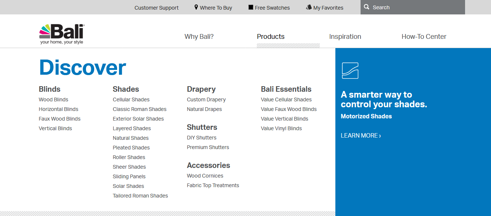
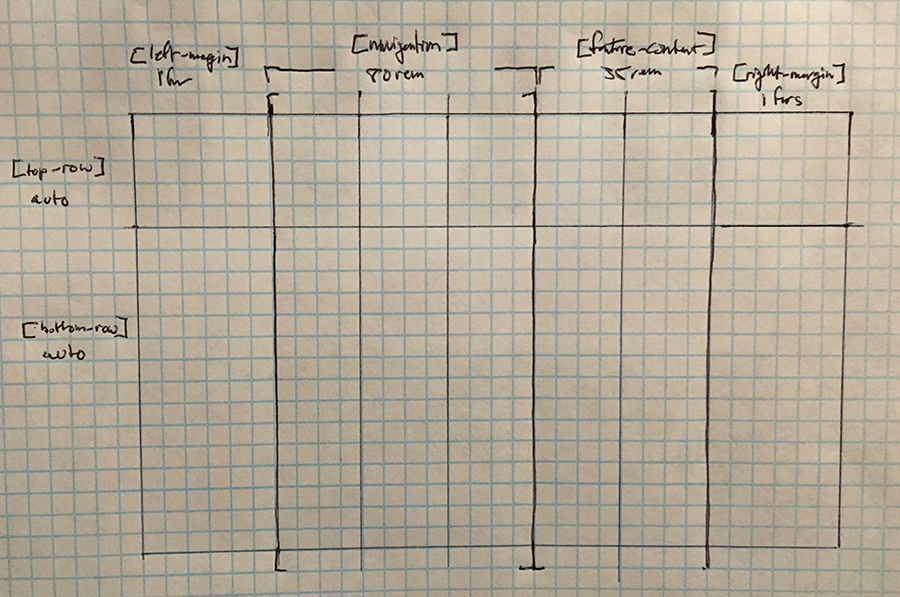

# Using CSS Grid Professionally

## Implementing a responsive CSS Grid and supporting IE 11

Recently, I published a menu component on baliblinds.com that uses CSS Grid. This happens to be my first major instance of implementing the grid layout on a large, consumer facing site.

My task was to update our menu system to include the Bali Essentials sub-menu you see below. This was originally built on bootstrap but our company is moving away from that, which allowed for an opportunity to implement a responsive grid. As you can imagine, the most difficult element here was supporting IE 11. 

For reference, this site is built in Episerver. Prior to building out the grid, I needed to re-develop the Razor templates and classes to work dynamically inside of the CMS. This proved to be a challenge as I had to strip out the old bootstrap HTML and rebuild the way we populate information in the menu.

From my experience, grid has a fairly even pros/cons list for usage on the sites I work on. Is it worth doing the work to back support IE 11? Should I just use Flexbox instead and fudge it until I get it to work? How many directions am I trying to accommodate in my layout? 

 As you can see, the menus are split into two different colors: white for the menus and a color block to the right that served as an accent for our featured content on any given menu.

I needed to create a menu that could place blocks of elements horizontally while also being able to align the sub-menus horizontally inside of there.

I fussed around with flexbox to start but found that I was going to have a hard time keeping the color block in place across different breakpoints. The way the background color was being applied within bootstrap was useful when we were using direct column widths, but when I switched to flexbox, I noticed that the color box needed to have somewhat rigid width but allow for the color to stretch outside of the container, to the end of the screen. This would have required specifically setting flexbox widths based on breakpoints and having to nest flexbox several times for the desired effect. 

From here, I decided to try out Grid. I ended up making the following grid for the outer layer of the menu and content container for margings. Grid ended up working out best for two reasons: fr units for responsiveness that collapse first when the screen size changes and the ability to have blank grid areas I can target and apply color to.

My development process here was to first get the grid to work at standard view port width. On this site, we have 2 breakpoints for our navigation on desktops: 992px and 1200px. Anything under 992px, would make the mobile navigation appear. This turned out to save me some hassle. After developing a grid for the 1200px menu, I was able to modify the main-content and feature-content grid areas to account for 992px. 

These are the 2 grid layouts I created. The @include lg is how we use breakpoints for our site. Here is a great resource on those [SASS responsive breakpoint mixins](https://daviseford.com/blog/2018/01/10/scss-responsive-media-query-mixins.html). I use these mixins on this website as well.

<pre>
  <code class="language-css">
  .bali-blinds .nav-block {
    display: -ms-grid;
    display: grid;
    grid-template-columns: [left-margin] 1fr [navigation] 65rem [feature-content] 30rem [right-margin] 1fr;
    grid-template-rows: [top-row] auto [bottom-row] auto;
  }

  @include lg {
    grid-template-columns: [left-margin] 1fr [navigation] 80rem [feature-content] 35rem [right-margin] 1fr;
  }

  </code>
</pre>
