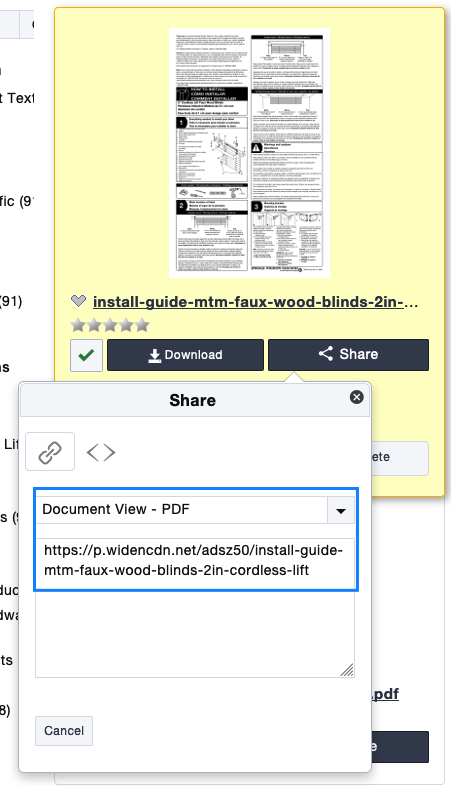

# Technical Documents
This serves as a resource for uploading and managing technical documents within 
Widen as defined by the IM web team. This will cover info on how assets are managed in widen as well as how they are implemented on our sites.

The following document types are considered technical documents and live within widen. 

* Measuring Guides
* Installation Guides
* Troubleshooting Guides
* Cleaning Instructions

With the exception of cleaning Instructions, each of these document types has a dedicated collection within Widen that should be considered the most current and up-to-date information. Keeping part numbers and IMR numbers updated are the only way we can know whats current. 

All documents can be viewed from this <a target="_blank" href="https://springswindowfashions.widencollective.com/portals/iardkp3q/TechnicalDocuments">portal</a> on widen

## Measuring Guides

Measuring Guides are brand specific. These should be flagged as 1_Sharable as well as by the brand that the document is. I.E. Graber, Bali, etc. Only use one of these.

brand-measuring-guide-product-line(s)-title(if different)

i.e. bali-measuring-guide-wood-faux-wood-blinds.pdf

### Measuring Guide Locations

#### Bali - Episerver
Baliblinds and costco US/CA all share the same blocks, meaning these only need to be updated once to effectively update in all 3 locations
* [https://www.baliblinds.com/how-to-center/how-to-measure/measuring-instructions/](https://www.baliblinds.com/how-to-center/how-to-measure/measuring-instructions/)
* [https://member.baliblinds.com/how-to-center/how-to-measure/measuring-instructions/](https://member.baliblinds.com/how-to-center/how-to-measure/measuring-instructions/)
* [https://member.baliblinds.ca/how-to-center/how-to-measure/measuring-instructions/](https://member.baliblinds.ca/how-to-center/how-to-measure/measuring-instructions/)
  
#### Bali - Java
These are also shared between all the java sites. updating in one will update all.
* [http://baliblinds.jcpenney.com/measure/index.jsp](http://baliblinds.jcpenney.com/measure/index.jsp)
* [http://lowes.baliblinds.ca/measure/index.jsp](http://lowes.baliblinds.ca/measure/index.jsp)
* [http://homedepot.baliblinds.com/measure/index.jsp](http://homedepot.baliblinds.com/measure/index.jsp)

#### Graberdirect - Sharepoint
Just overwrite these in the resource library.

#### Lowes Graber Retail CA - Java
This is located in the Graber Retail project within Eclipse

* [http://lowes.graberblinds.ca/measure/index.jsp](http://lowes.graberblinds.ca/measure/index.jsp)

## Installation Guides

Install guides are non-brand specific. These should all be flagged in asset security as 1_Sharable and 2_All Company Assets. This will allow them to show up in the API query.

Install guides aren't branded. This means that each document is used across all of our sites.

Here is a list of locations and links:

 

### Naming conventions

*installation-product-lines-control-type-name-of-document*

i.e installation-aluminum-cordless-inside-ceiling-outside-mount.pdf

## Linking to Widen Documents

All documents links should use a widen link going forward. The method for linking documents is using the share dropdown on a PDF and grabbing the Document View - PDF link. (don't use the embed link. this isn't necessary in the same way that it is for images.)

