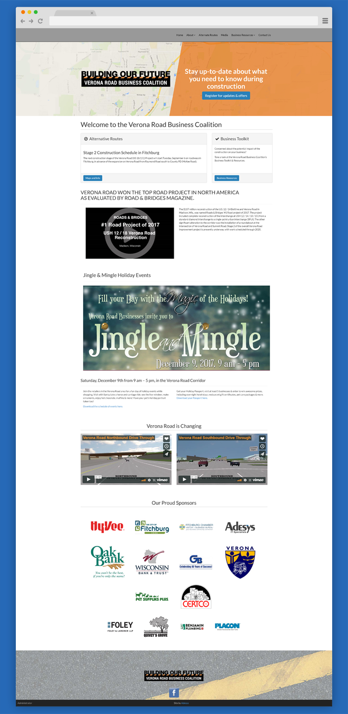

The Verona Road Business Coalition was brought into existence when it was announced that there would be 5 years of continuous construction on the Verona Road beltline exit. I was brought in to design the site using Bootstrap and it was later converted to a .NET CMS called Umbraco by the awesome web agency Adesys based out of Verona. The purpose of the site was to provide ongoing information for locals to know what business' are open and for those business' to provide discounts.

